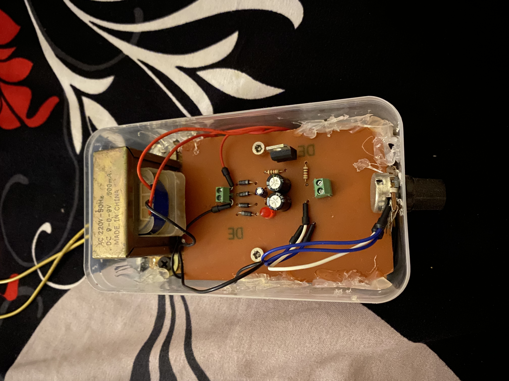

# PCB Power Supply

## Project Overview

A custom-designed PCB power supply developed as a practical electronics and PCB design project.

The project focuses on circuit design, PCB layout, component integration, and practical hardware implementation.

## Features

- Custom PCB design
- Electronic circuit design
- PCB layout and routing
- Component integration
- Practical hardware implementation

## Skills & Technologies

- PCB Design
- Electronic Circuit Design
- Hardware Prototyping
- Soldering
- Circuit Analysis
  
  ## My Contribution

- Designed the electronic circuit.
- Designed the PCB layout using Circuit Wizard.
- Worked on the practical implementation of the PCB.
- Tested the power supply circuit and verified its operation.

## Project Demo

[🎥 Watch the Project Demo](./dee31aeb-38f9-421f-bbbb-5f3d499130b6.mov)

## Project Image

This repository contains the project documentation, PCB design files, project images, and demonstration video.

## Project Status

Completed
